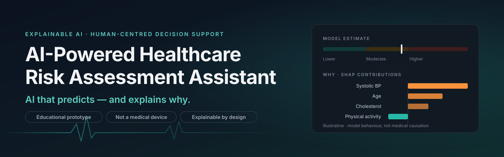
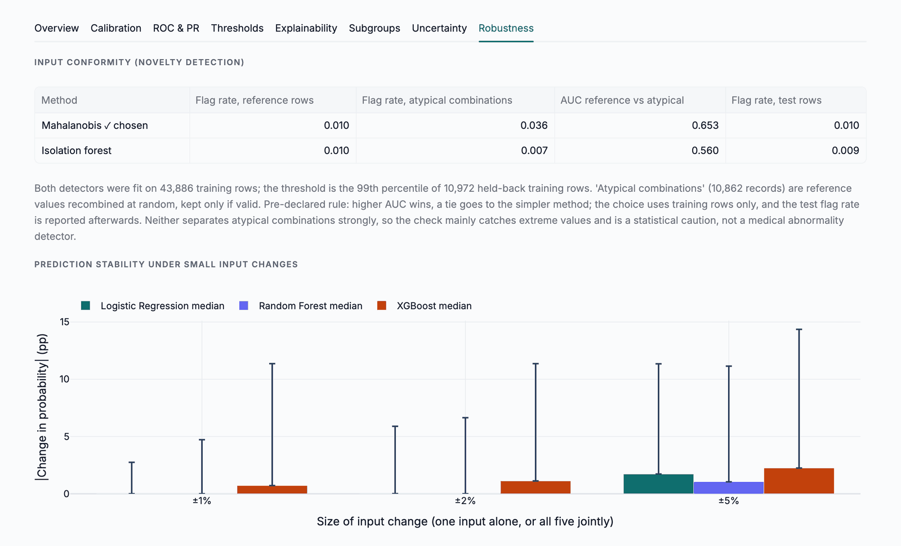
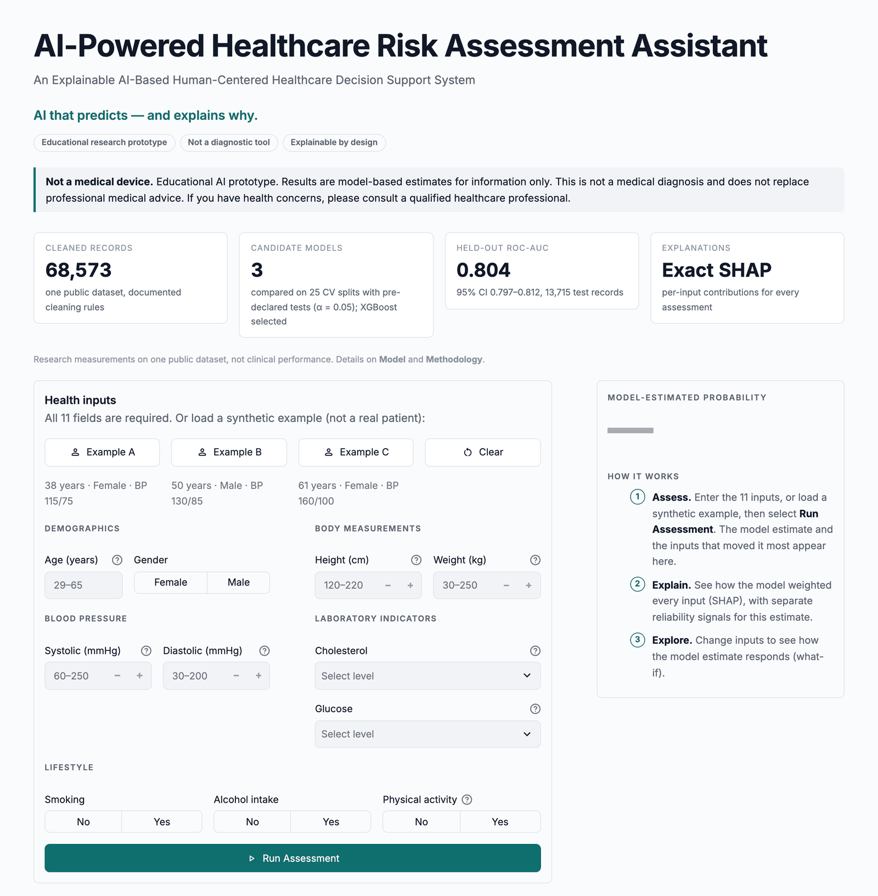
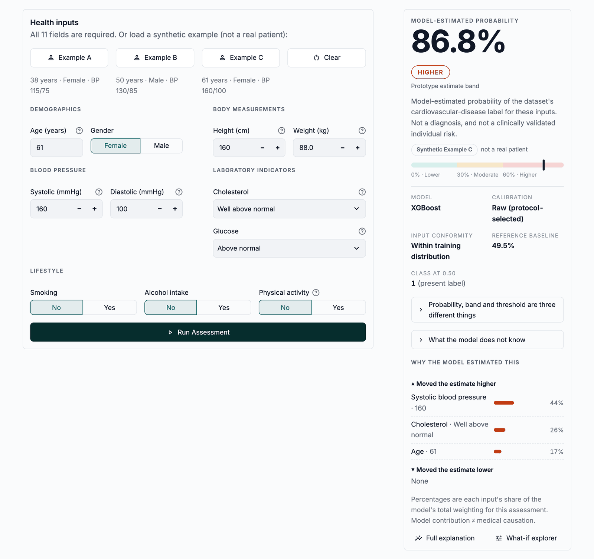
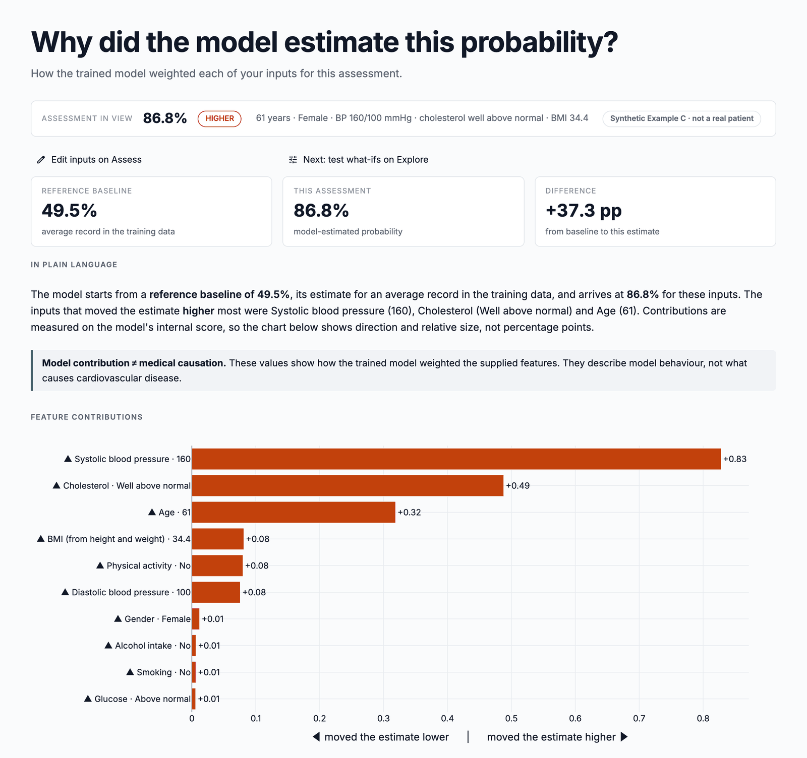
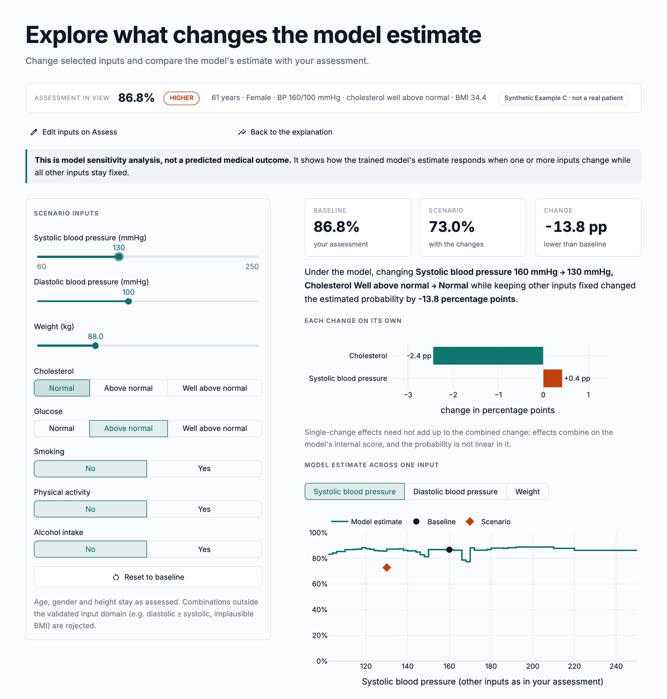
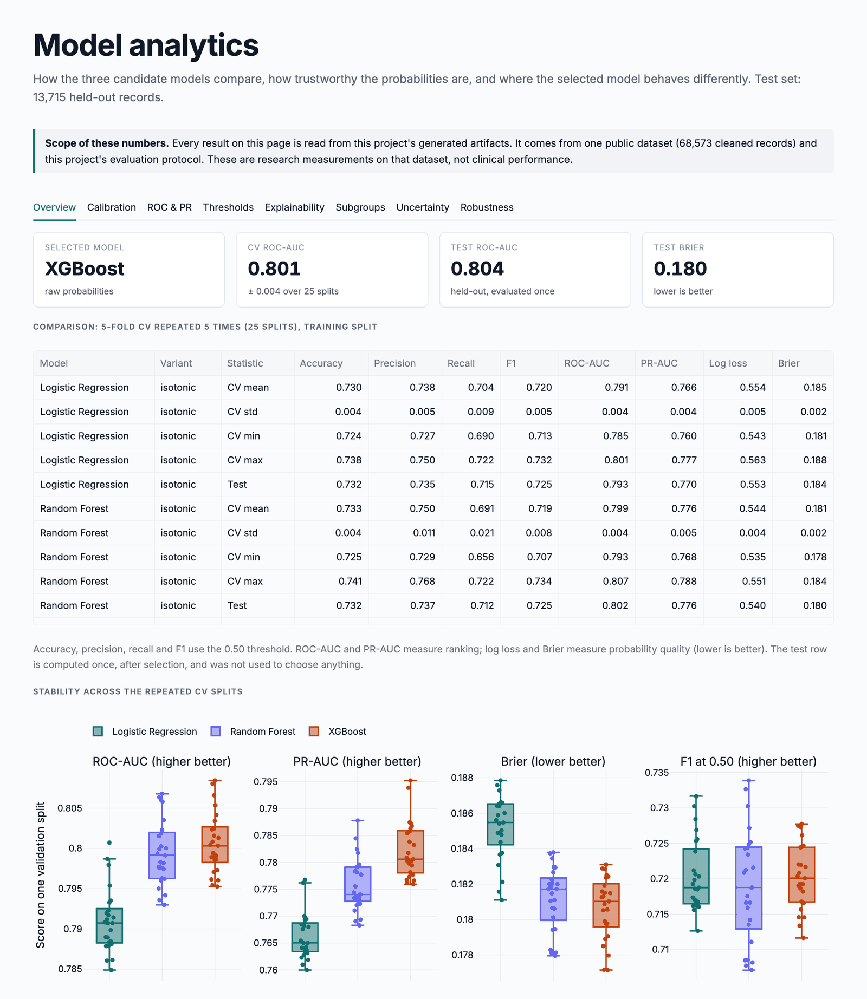
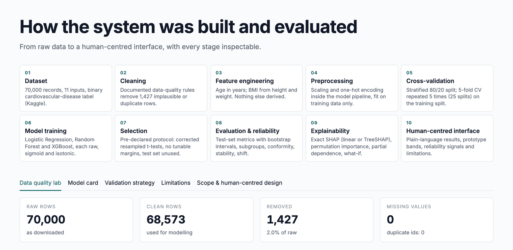

<p align="center">
  
</p>

# AI-Powered Healthcare Risk Assessment Assistant

[](https://github.com/soyebmohammad03-dev/AI-Powered-Healthcare-Risk-Assessment-Assistant/actions/workflows/tests.yml)
[](https://github.com/soyebmohammad03-dev/AI-Powered-Healthcare-Risk-Assessment-Assistant/tags)
[](.python-version)
[](requirements.txt)
[](requirements.txt)
[](requirements.txt)
[](requirements.txt)
[](LICENSE)

**An Explainable AI-Based Human-Centered Healthcare Decision Support System.**

> ***AI that predicts — and explains why.***

An educational research prototype, built for the B.Tech course *Design of Artificial Intelligence Products*. From 11 everyday health inputs, it estimates the probability of a cardiovascular-disease label in a public dataset. It explains every estimate with exact SHAP, lets you test what-if scenarios, and reports separate reliability signals and the model's known weaknesses alongside the estimate.

> [!IMPORTANT]
> **Not a medical device.** This prototype does not diagnose, screen, triage or recommend treatment, and it is not clinically validated. Its probabilities agree with one public dataset's labels; they are not clinical risks. See the [disclaimer](#ethical--medical-disclaimer).

---

**Contents:** [Overview](#overview) · [Key features](#key-features) · [How it works](#how-it-works) · [Architecture](#architecture) · [Results](#results) · [Walkthrough](#application-walkthrough) · [Installation](#installation) · [Reproduce results](#reproduce-results) · [Limitations](#limitations) · [Docs](docs/README.md)

## Overview

The app answers four questions a person should be able to ask of any AI estimate:

| Question | Where the app answers it |
|---|---|
| What does the model estimate for these inputs? | **Assess**: the model-estimated probability, a prototype band, and the inputs that moved it most |
| Why? | **Explain**: an exact SHAP breakdown of this estimate, in a chart and in plain language |
| What would change it? | **Explore**: what-if scenarios and response curves, with warnings where the model behaves non-monotonically |
| How far can I trust it? | **Explain**, **Model** and **Methodology**: separate reliability signals, calibration, subgroup gaps, robustness tests and limitations |

The model was chosen by a protocol declared *before* the comparison was run, and the result was accepted even though it is not the most interpretable candidate. Its weaknesses are measured and shown in the app, not hidden.

## Why this project?

Tabular health models are often shown as a single number. That hides the questions that matter for responsible use: what drove the estimate, how stable it is, whether the input even resembles the training data, and where the model is known to be weaker. This project treats those questions as part of the product:

- **Explainability as a requirement.** A model was eligible only if it had an exact, additive SHAP explanation.
- **Evidence before claims.** Every number in the app and the docs is read from a generated artifact with provenance.
- **Honest uncertainty.** Reliability signals are shown side by side and never merged into an invented "trust score".
- **Human-centred wording.** "Model-estimated probability" rather than "your risk"; guidance from transparent rules, never a diagnosis.

## Key features

- **Evidence-selected model.** Logistic Regression, Random Forest and XGBoost, each raw, sigmoid- or isotonic-calibrated (9 variants), compared on 25 repeated-CV splits with pre-declared corrected t-tests.
- **Exact explanations.** TreeSHAP per assessment, reconciled with the model's own output; global SHAP, permutation importance and PDP/ICE.
- **What-if analysis.** Guarded scenarios that reject impossible inputs, single-change effects and response curves.
- **Reliability signals.** For each assessment: input conformity (novelty detection), explanation stability under small perturbations, disagreement between candidate models, and calibration status.
- **Model analytics.** Calibration, ROC/PR, thresholds and decision trade-off, subgroup performance, bootstrap uncertainty and robustness, all read from committed artifacts.
- **Data Quality Lab and model card.** What was removed from the data and why, plus a formal statement of intended use and limitations.
- **Synthetic demo inputs.** Three clearly labelled examples (not real patients) to try the app in one click.
- **Reproducible.** One setup script, a checksum-pinned dataset, pinned dependencies, seed 42 throughout, 162 tests and CI.

## How it works

1. **Assess.** Enter 11 inputs (age, gender, height, weight, systolic and diastolic blood pressure, cholesterol, glucose, smoking, alcohol, physical activity) or load a synthetic example. Inputs are validated against plausible ranges before they reach the model.
2. **Estimate.** The saved pipeline derives BMI, preprocesses the inputs and returns XGBoost's model-estimated probability. A prototype display band (Lower < 30%, Moderate 30–60%, Higher ≥ 60%) and the class at 0.50 are shown as separate concepts.
3. **Explain.** Exact TreeSHAP shows how much each input pushed the estimate up or down from the reference baseline (the estimate for an average training record).
4. **Check.** Reliability signals flag unusual inputs, unstable explanations and model disagreement; rule-based guidance adds general, non-diagnostic information.
5. **Explore.** Change blood pressure, weight, laboratory values or lifestyle inputs and see how the model estimate responds.

## Architecture

<p align="center"></p>

The **offline research pipeline** (`src.train_models` → `src.analysis` → `src.reliability` → `src.shift_analysis`) writes the models and the committed analysis artifacts. The **Streamlit app** (`app.py`, `ui/`) only loads them: it never retrains. All model logic lives in `src/`; the UI holds none. Details, the module map and the saved-file contract are in [docs/architecture.md](docs/architecture.md).

## Explainable AI

- **Local:** exact TreeSHAP on XGBoost's log-odds score, re-anchored so that baseline + contributions equals the model score; it reconciles with the model output within 1e-5. Contributions are mapped to the displayed probability, keeping each one's direction.
- **Global:** mean |SHAP|, permutation importance, partial dependence and ICE curves, and the strongest pairwise interactions. Systolic blood pressure carries 49% of the attribution, age 16% and cholesterol 13%.
- **Model behaviour, not causation.** In this dataset, smokers and drinkers have slightly *lower* label rates (a confounded pattern), and the model reproduces it. The app says so wherever it could mislead.

## Reliability & robustness

<p align="center"></p>

| Signal | What it measured on this dataset |
|---|---|
| Input conformity | A Mahalanobis-distance detector, fitted and chosen on training rows only, flags about 1% of inputs as unusual. Unusual inputs get a caution, never a block. |
| Prediction stability | A 1% change to one input can move XGBoost's estimate by up to 37 percentage points (pp); the 95th percentile is 11 pp. |
| Explanation stability | XGBoost's top-5 explanation features stayed identical in 74% of ±1% perturbations, against 95% for Logistic Regression. |
| Monotonicity | For every tested profile, XGBoost's curves in blood pressure, age and weight are non-monotone. |
| Model disagreement | Across the three candidates, the median spread is 5 pp and the 95th percentile 17 pp. |
| Synthetic shift | Ranking drops to about 0.75 ROC-AUC in older or higher-blood-pressure resampled populations; a +10 mmHg recording offset inflates the mean estimate by 14 pp. A controlled experiment, not external validation. |

## Dataset

[Cardiovascular Disease dataset](https://www.kaggle.com/datasets/sulianova/cardiovascular-disease-dataset) by S. Ulianova (Kaggle): 70,000 records, 13 columns, semicolon-separated. It is downloaded from Kaggle's public API (no account) and pinned by SHA-256; it is not redistributed here.

- **Why this dataset:** enough records for credible repeated CV, calibration, bootstrap and subgroup analysis, and 11 inputs that a non-specialist can supply.
- **Cleaning:** documented rules remove 1,427 rows (24 duplicates and implausible measurements, such as a blood pressure of 16,020), leaving **68,573** records (34,646 absent, 33,927 present). Every rule is shown in the app's Data Quality Lab.
- **Features:** age (converted from days to years), gender, height and weight (combined into BMI, the only engineered feature), systolic and diastolic blood pressure, cholesterol and glucose (three levels), smoking, alcohol and physical activity (self-reported). `id` is never used.
- **Target:** `cardio` (1 = cardiovascular disease present).

## Machine learning

- **Split:** stratified 80/20 with seed 42 (54,858 train / 13,715 test). The test set was used only after selection.
- **Comparison:** 5-fold CV repeated 5 times (25 splits) on the training split. Preprocessing and calibration are fitted inside each split, and every training row gets out-of-fold predictions.
- **Metrics:** accuracy, precision, recall, F1, ROC-AUC, PR-AUC, log loss, Brier score, ECE, and calibration slope and intercept.
- **Selection protocol** (declared before the repeated-CV run; no tunable margins):
  - every comparison is a corrected resampled t-test (Nadeau–Bengio) on the same 25 splits at α = 0.05;
  - keep raw probabilities unless a calibrator lowers CV Brier significantly;
  - a model needs an exact SHAP explanation to be eligible;
  - starting from the most interpretable model (LR → RF → XGBoost), move on only for a significant gain in **both** ROC-AUC and Brier.
- **Selected: XGBoost, raw probabilities.** Its raw probabilities already agree closely with observed frequencies (out-of-fold ECE 0.004, slope 0.99), so no calibrator was adopted.

Full procedures: [docs/methodology.md](docs/methodology.md).

## Results

Held-out test set (13,715 records), evaluated once after selection; 95% bootstrap intervals in brackets.

| Model (selected variant) | CV ROC-AUC (25 splits) | Test ROC-AUC [95% CI] | Test PR-AUC | Test Brier [95% CI] | Test F1 at 0.50 |
|---|---|---|---|---|---|
| Logistic Regression (isotonic) | 0.791 ± 0.004 | 0.793 [0.786, 0.801] | 0.770 | 0.184 [0.181, 0.188] | 0.725 |
| Random Forest (isotonic) | 0.799 ± 0.004 | 0.802 [0.795, 0.810] | 0.776 | 0.180 [0.177, 0.184] | 0.725 |
| **XGBoost (raw) — selected** | **0.801 ± 0.004** | **0.804 [0.797, 0.812]** | **0.785** | **0.180 [0.176, 0.183]** | 0.722 |

**How to read these numbers:**
- XGBoost's advantage is small (about +0.011 ROC-AUC over Logistic Regression) but consistent across splits. Its costs are measured in [Reliability & robustness](#reliability--robustness).
- **Thresholds:** at 0.30, 0.50 and 0.70, recall/specificity is 0.89/0.48, 0.69/0.78 and 0.52/0.89. No threshold is called optimal.
- **Subgroups:** the gender groups are similar (ROC-AUC 0.803 / 0.806), but ranking falls with age, from 0.830 at 40–49 to **0.699 [0.678, 0.722] at 60–65**.
- These results are **specific to one public dataset** and measure agreement with its labels. The dataset is not an external clinical cohort, and **none of this is clinical validation**.

Every number is in [docs/evaluation.md](docs/evaluation.md) and traced to its artifact in [docs/RESEARCH_VALIDATION.md](docs/RESEARCH_VALIDATION.md).

## Application walkthrough

Real screenshots of the running app, using the synthetic example inputs (not real patients).

<table>
  <tr>
    <td width="50%" valign="top"><a href="docs/assets/screenshots/01-assess-landing.png"></a><br><sub><b>Assess.</b> Disclaimer, headline research facts read from the artifacts, the grouped input form, synthetic examples, and how the flow works.</sub></td>
    <td width="50%" valign="top"><a href="docs/assets/screenshots/02-assess-result.png"></a><br><sub><b>Result.</b> Model-estimated probability, prototype band, input conformity, reference baseline and the inputs that moved the estimate most.</sub></td>
  </tr>
  <tr>
    <td width="50%" valign="top"><a href="docs/assets/screenshots/03-explain-shap.png"></a><br><sub><b>Explain.</b> Baseline → estimate, a plain-language summary and the exact SHAP contribution of every input.</sub></td>
    <td width="50%" valign="top"><a href="docs/assets/screenshots/04-explore-what-if.png"></a><br><sub><b>Explore.</b> A what-if scenario, each change on its own, and the model estimate across one input, which shows XGBoost's steps.</sub></td>
  </tr>
  <tr>
    <td width="50%" valign="top"><a href="docs/assets/screenshots/05-model-analytics.png"></a><br><sub><b>Model.</b> Candidate comparison across the 25 CV splits, then tabs for calibration, ROC &amp; PR, thresholds, explainability, subgroups, uncertainty and robustness.</sub></td>
    <td width="50%" valign="top"><a href="docs/assets/screenshots/07-methodology.png"></a><br><sub><b>Methodology.</b> The ten-stage pipeline, then the Data Quality Lab, model card, validation strategy, limitations and scope.</sub></td>
  </tr>
</table>

## Installation

**Requirements:** Python **3.12**, macOS on Apple Silicon (verified; Linux should work, Windows is untested), and on macOS `brew install libomp` for XGBoost.

```bash
git clone https://github.com/soyebmohammad03-dev/AI-Powered-Healthcare-Risk-Assessment-Assistant.git
cd AI-Powered-Healthcare-Risk-Assessment-Assistant
./scripts/setup.sh
```

`setup.sh` creates `.venv`, installs the pinned dependencies, checks that XGBoost can load OpenMP, downloads and validates the dataset, trains any missing models and scores the three demo inputs. The first run takes about 10 minutes, mostly model training. It is safe to rerun. To choose an interpreter, use `PYTHON=/path/to/python3.12 ./scripts/setup.sh`.

## Dataset setup

Automatic: `setup.sh` (or the first pipeline command) downloads the dataset and checks its SHA-256 and the cleaned row count of 68,573. No account or credentials are needed.

If the download fails, download `cardio_train.csv` manually from the [Kaggle page](https://www.kaggle.com/datasets/sulianova/cardiovascular-disease-dataset) and place it at `data/cardio_train.csv`; the checksum is still verified. The schema and checksum are in [docs/reproducibility.md](docs/reproducibility.md#dataset).

## Run the application

```bash
.venv/bin/streamlit run app.py
```

Open the URL Streamlit prints (by default http://localhost:8501), select **Example A**, **B** or **C**, then **Run Assessment**.

## Run tests

```bash
.venv/bin/python -m pytest -q
```

162 tests, about 35 seconds once the models exist. They cover metric invariants, repeated CV and out-of-fold leakage, test-set integrity (nothing is chosen on the test set), the selection protocol, calibration and bootstrap reproducibility, reliability statistics, SHAP reconciliation for every candidate, what-if guardrails, guidance language, every UI page through Streamlit's `AppTest`, and portability (no machine-specific paths, pinned requirements, provenance, stale models rejected). The same suite runs in CI on every push.

## Reproduce results

```bash
./scripts/setup.sh --regenerate
```

This retrains every model and rebuilds all four committed artifacts in pipeline order. Seed 42 is used throughout, the dataset is checksum-pinned and the dependencies are pinned. Selection decisions are identical on regeneration; the tree models reproduce to floating-point precision. Each artifact records its provenance (generation time, versions, dataset SHA-256, seed). See [docs/reproducibility.md](docs/reproducibility.md).

| Task | Command |
|---|---|
| Retrain the models only | `.venv/bin/python -m src.train_models` |
| Rebuild one analysis | `.venv/bin/python -m src.analysis` (or `src.reliability`, `src.shift_analysis`) |
| Check the saved model | `.venv/bin/python -m src.prediction` |

## Repository structure

```
app.py                      Streamlit entry point (top navigation)
ui/                         the five pages + shared components (no model logic)
src/                        data, preprocessing, evaluation, training, analysis, reliability,
                            prediction, SHAP, what-if and rule-based guidance
artifacts/*.json            generated, committed analysis outputs (with provenance)
models/, data/              generated / downloaded locally, not committed
tests/                      pytest suite (162 tests)
scripts/setup.sh            fresh-clone setup and full regeneration
docs/                       documentation index, architecture, reproducibility, methodology,
                            evaluation, research validation, model card; assets/ for images
.github/workflows/tests.yml CI: setup + full test suite on macOS (Apple Silicon)
```

## Limitations

> [!WARNING]
> Read these before drawing any conclusion from the model.

- **Single public dataset, no external validation.** Every result describes one Kaggle dataset of limited provenance. Nothing has been validated on a clinical population.
- **Observational data, not causality.** The model reproduces confounded patterns (smoking and alcohol show *lower* label rates here; glucose "well above normal" also behaves unexpectedly). SHAP describes model behaviour, never medical cause and effect.
- **Subgroup differences.** Ranking is clearly weaker for ages 60–65 (ROC-AUC 0.699). Only gender and age bands could be examined; the dataset records no other demographics, so no fairness claim is made.
- **Non-monotone, step-wise behaviour.** XGBoost's estimate can fall when blood pressure, age or weight rises, and responds in steps at its split points.
- **Sensitivity to small input changes.** A 1% change can move the estimate by many percentage points, and explanations are less stable than Logistic Regression's.
- **Limited feature set.** 11 inputs; lifestyle inputs are self-reported and laboratory values are coarse three-level categories. No history, medication, symptoms or examination findings.
- **Coverage.** Training data covers ages 29–65 only; other ages are rejected.
- **Prototype bands and thresholds** are presentation choices, not clinical cut-offs.
- **Not a clinical system.** Not for diagnosis, screening, triage, treatment or any clinical decision.

The full list is in the [model card](docs/model_card.md).

## Ethical / medical disclaimer

This project is an educational AI decision-support prototype. It is **not a medical device**, a diagnostic system, or a substitute for professional medical advice. Its outputs are model-based estimates of agreement with one public research dataset's labels, are not clinically validated, and should not be interpreted as an individual clinical diagnosis or treatment guidance. If you have health concerns, please consult a qualified healthcare professional.

The guidance shown in the app comes from fixed, transparent rules, with no LLM. It never states a condition or names a treatment, and a lower estimate is described as not ruling out any health condition.

## Future work

- External validation on a dataset with documented clinical provenance.
- A monotone-constrained XGBoost model, evaluated under the same pre-declared protocol, to address the step-wise and non-monotone responses.

## License

[MIT](LICENSE) © 2026 Soyeb Mohammad. The dataset is not covered by this license; it is subject to its own terms on Kaggle.

`v1.0.0` is the frozen research release. Later commits on `main` polish the user interface, documentation and repository presentation; the model, the dataset, the evaluation methodology and every reported result are unchanged.
