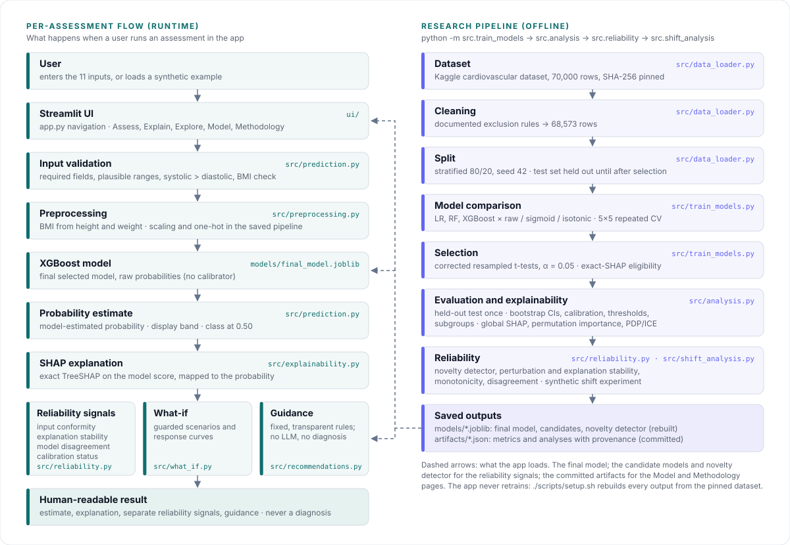

# Architecture

The system has two halves that meet at a small set of saved files:

- an **offline research pipeline** that cleans the data, compares and selects models, evaluates the selected one and analyses its reliability, writing everything to `models/` and `artifacts/`;
- a **Streamlit app** that loads those files and, for each assessment, validates the inputs, runs the saved pipeline, explains the estimate and reports separate reliability signals.

The app never retrains and never recomputes the global analyses; it only reads them.



## Runtime: one assessment

| Step | What happens | Code |
|---|---|---|
| Input | The user enters 11 inputs on **Assess**, or loads one of three synthetic examples (not real patients). | `ui/assess.py` |
| Validation | `PatientInput` rejects missing values, values outside the plausible ranges, systolic ≤ diastolic and implausible BMI, with readable messages. Nothing reaches the model unvalidated. | `src/prediction.py`, `src/preprocessing.py` |
| Preprocessing | BMI is derived from height and weight; scaling and one-hot encoding live inside the saved scikit-learn pipeline, fitted on training rows only. | `src/preprocessing.py` |
| Model | The final pipeline (XGBoost, raw probabilities) is loaded from `models/final_model.joblib`. The loader rejects a file built with other library versions or a different feature contract. | `src/prediction.py` |
| Estimate | Model-estimated probability of the dataset label, the prototype display band and the class at 0.50, shown as three separate concepts. | `src/prediction.py`, `src/recommendations.py` |
| Explanation | Exact TreeSHAP on the model's score, mapped to the probability; shown on **Explain**. | `src/explainability.py` |
| Reliability signals | Input conformity (novelty detector), explanation stability under small perturbations, disagreement between the three candidate models, and calibration status. Shown side by side, never combined into one score. | `src/reliability.py` |
| What-if | Guarded scenarios and response curves on **Explore**; impossible combinations are rejected and the stored assessment is never modified. | `src/what_if.py` |
| Guidance | Fixed, transparent rules on the inputs and the band. No LLM; never states a condition or names a treatment. | `src/recommendations.py` |

`ui/core.py` holds the shared components and the cached resources (model, explainer, novelty detector, candidate models), so each is loaded once per server.

## Offline: the research pipeline

Run in this order; each step is a module run with `python -m`:

| Step | Module | Writes |
|---|---|---|
| Download, checksum, clean, split | `src/data_loader.py` (used by every step) | `data/cardio_train.csv` (not committed) |
| 9-variant repeated-CV comparison and pre-declared selection | `src.train_models` | `models/*.joblib`, `artifacts/metrics.json`, `artifacts/oof_predictions.npz` |
| Test-set evaluation, bootstrap, thresholds, subgroups, global explanations, data-quality report | `src.analysis` | `artifacts/analysis.json` |
| Calibration deep dive, novelty detector, perturbation and explanation stability, monotonicity, disagreement | `src.reliability` | `artifacts/reliability.json`, `models/novelty_detector.joblib` |
| Synthetic distribution-shift experiment | `src.shift_analysis` | `artifacts/shift_analysis.json` |

`./scripts/setup.sh --regenerate` runs all four. The procedures are in [methodology.md](methodology.md) and the measured results in [evaluation.md](evaluation.md).

## Module map

```
src/data_loader.py      download + checksum, cleaning rules (with exclusions), train/test split
src/preprocessing.py    schema, plausibility ranges, labels, BMI, preprocessing pipeline
src/evaluate_models.py  metrics, repeated OOF CV, corrected t-test, calibration stats, thresholds,
                        decision curve, bootstrap, subgroups
src/train_models.py     9-variant repeated-CV comparison, selection protocol, persistence
src/analysis.py         test-set analyses + data-quality report
src/reliability.py      reliability analyses; per-assessment reliability checks used by the app
src/shift_analysis.py   synthetic distribution-shift experiment
src/prediction.py       input contract (PatientInput), artifact checks, prediction, demo inputs
src/explainability.py   exact SHAP (linear or TreeSHAP) on the model score, probability mapping
src/what_if.py          guarded what-if scenarios and response curves
src/recommendations.py  rule-based informational guidance, prototype bands, disclaimer
app.py                  Streamlit entry point (top navigation)
ui/core.py              design tokens, cached resources, shared components
ui/{assess,explain,explore,model,methodology}.py   the five pages
```

## Saved files

| Path | Committed | Produced by | Read by |
|---|---|---|---|
| `artifacts/metrics.json`, `analysis.json`, `reliability.json`, `shift_analysis.json` | yes, each with a `provenance` block | the four pipeline modules | the Model and Methodology pages, the Assess header, the Explain and Explore notes |
| `models/final_model.joblib` | no (rebuilt) | `src.train_models` | every assessment |
| `models/{logistic_regression,random_forest,xgboost}.joblib` | no (rebuilt) | `src.train_models` | model-disagreement signal |
| `models/novelty_detector.joblib` | no (rebuilt) | `src.reliability` | input-conformity signal |
| `artifacts/oof_predictions.npz` | no (rebuilt) | `src.train_models` | `src.reliability` |
| `data/cardio_train.csv` | no (downloaded) | `src/data_loader.py` | the offline pipeline and the tests (TreeSHAP for the selected XGBoost needs no background data) |
